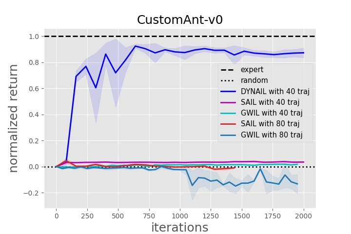
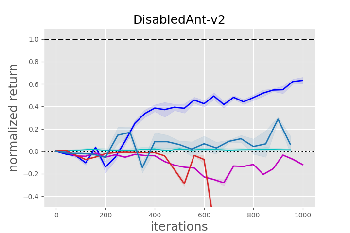
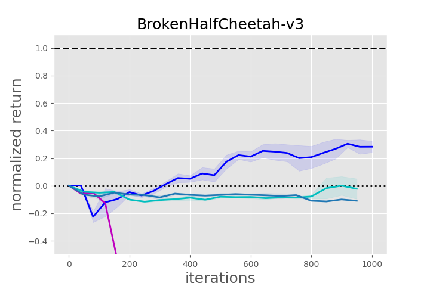
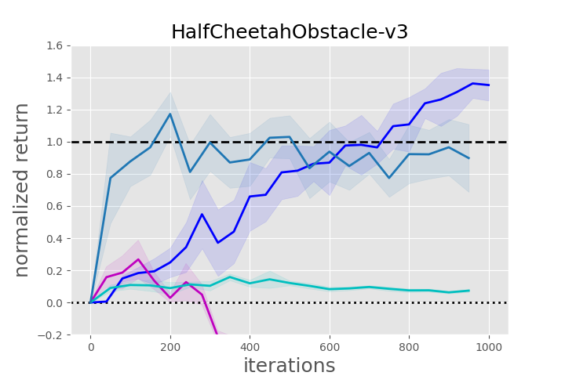

# DYNAIL

## Experiments with [realworldrl-suite](https://github.com/google-research/realworldrl_suite)

### Source Domain: Quadruped

    
     
    source expert in source domain

### Target Domain: Quadruped with Low Friction

    
     
    source expert and behavior cloning in target domain

    
     
    target expert and dynail in target domain

## Additional Experiments with More Demonstrations

    
     
    SAIL and GWIL with more demonstrations in Ant environments

    
     
    SAIL and GWIL with more demonstrations in HalfCheetah environments

For computational complexity, it takes a long time for SAIL with 80 expert trajectories (80000 transitions) to train. Thus, the figure is to be updated until the training of SAIL is finished.
