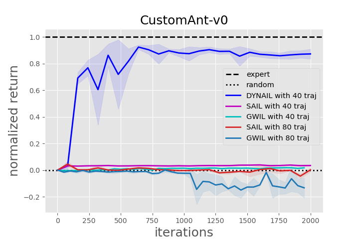
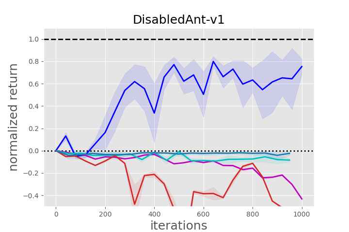
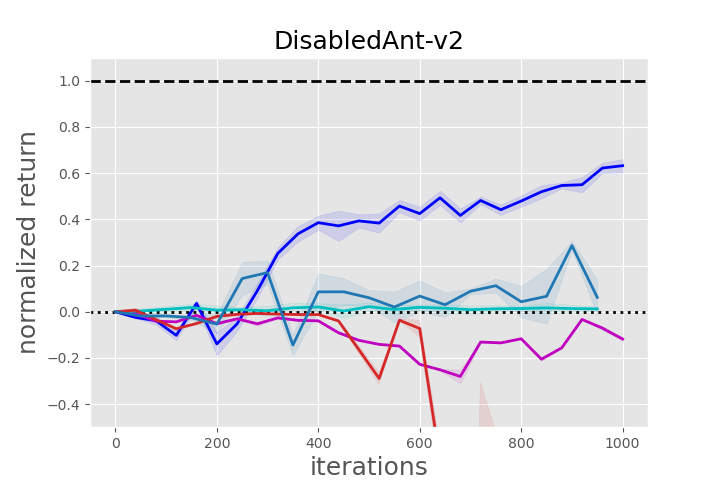
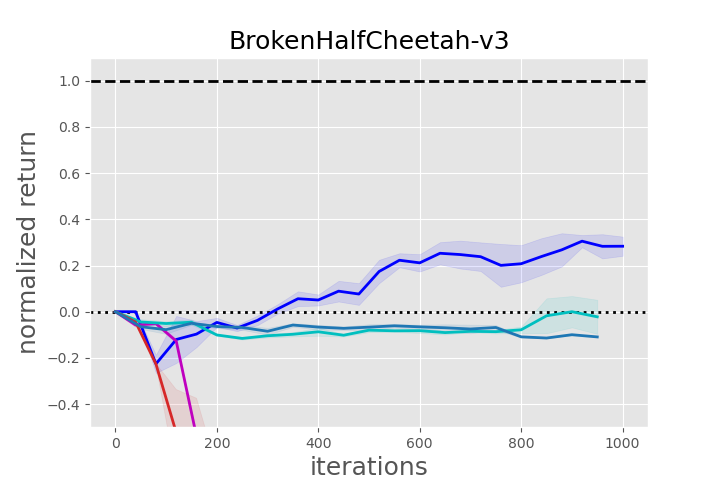
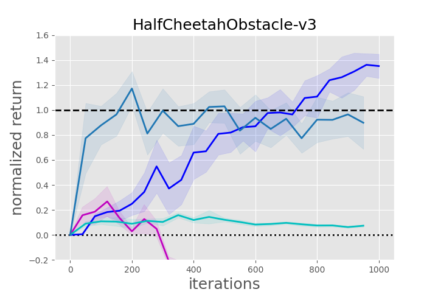

# DYNAIL

## Experiments with [realworldrl-suite](https://github.com/google-research/realworldrl_suite)

### Source Domain: Quadruped

    
     
    source expert in source domain

### Target Domain: Quadruped with Low Friction

#### Direct Transfer

    
     
    source expert and behavior cloning in target domain

#### Our Method: DYNAIL

    
     
    DYNAIL in target domain

## Additional Experiments with More Demonstrations

We increase the expert demonstrations from 40k to 80k for the existing SOTA methods (SAIL and GWIL). With more expert demonstrations, these baselines improve, yet DYNAIL still has superior performance with only 40k expert samples. We will update these experiments to our final version of the paper.

    
     
    SAIL and GWIL with more demonstrations in Ant environments

    
     
    SAIL and GWIL with more demonstrations in HalfCheetah environments

For computational complexity, it takes a long time for SAIL with 80 expert trajectories (80000 transitions) to train. Thus, the figures above are to be updated until the training of SAIL is finished.
