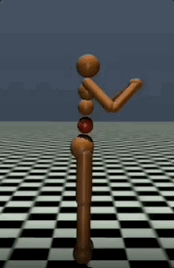

# DYNAIL

## Experiments with [realworldrl-suite](https://github.com/google-research/realworldrl_suite)

### Source Domain: Quadruped

    
     
    source expert in source domain

### Target Domain: Quadruped with Low Friction

#### Direct Transfer

    
     
    source expert and behavior cloning in target domain

Both of quadruped robots overturn on the groud with low friction.

#### Our Method: DYNAIL

    
     
    DYNAIL in target domain

Our method succeeds in quadruped task with low friction.

## Experiments with High-Dimensional Environment Humanoid

### Source Domain: Humanoid-v3

    
     
    source expert in source domain

### Target Domain: BrokenHumanoid-v3 (Humanoid-v3 with red broken abdomen joint)

#### Direct Transfer

    
     
    source expert and behavior cloning in target domain

Both of the episodes above terminate because of unhealthy conditions.

#### Our Method: DYNAIL

    
     
    DYNAIL in target domain

Our method succeeds in humanoid task with red broken abdomen.

## Experiments with Maze (breaking assumptions)

### Source Domain: UMaze-v0

    
     
    source expert in source domain

### Target Domain: IMaze-v0 (Moving the middle wall block to the right)

#### Direct Transfer

    
     
    behavior cloning and GWIL in target domain

Both of the baselines fail to find the way to the goal.

#### Our Method: DYNAIL

    
     
    DYNAIL in target domain

Our method succeeds in maze task with a moving wall block.

